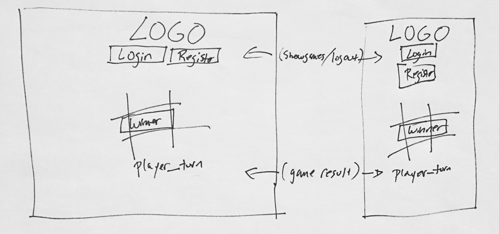

# Game Project Scope Study

## Required Readings

-   [Game Project](https://github.com/ga-wdi-boston/game-project)
-   [Game API](https://github.com/ga-wdi-boston/game-project-api)
-   [What is a User Story](https://www.mountaingoatsoftware.com/agile/user-stories)

## Deliverables

After reading the `game-project` prompt and the `game-project-api` documentation
please do the following and be prepared to share and discuss during our next
class.

Submit detailed answers to the following in this file via a pull request:

-   A wireframe of what your game project will look like.
  - 

-   The data structure you plan to use.
  - an array to hold the status of the board and each tile

-   How you will take the markup of the game board and represent it in JS
  - it will be an array that shows empty string, x, or o depending on the moves the players have made

-   How you plan to approach this project.
  - breaking up the user stories to get a certain amount of steps done from be

-   4-8 user stories for your game project.
  - A user should be able to
    - sign up
    - log in
    - change password
    - start a new game as player x
    - join a game as player o
  - A board that visually displays the state of the game and whether or not it is that player's turn
  - If it is their turn the board should display available tiles and them to move into any of those
  - The board should display the results of the game immediately after the winning tile is played
  - The game over notice should allow either player to initiate a new game with the same opponent

-   How you plan to keep your code modular.
  - breaking up each part of the logic into its own section or file

-   What creative spin will you add to your project?
  - an original theme/graphics after all logic/basic function is complete

-   How will you use version control to backup / track your project?
  - as each function is complete and functional will push and then test to confirm no conflicting code/dependencies

-   Do you plan to attempt any of the bonuses?
  - only if I have time

You may want to submit pictures for your wireframes and/or user stories.
[Markdown Cheatsheet](https://github.com/adam-p/markdown-here/wiki/Markdown-Cheatsheet)
has instructions to link to a picture you've uploaded to a service like [Imgur]
(http://imgur.com/).
